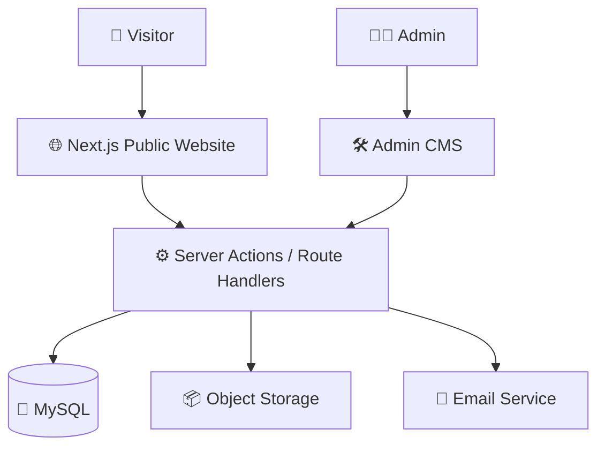

<div align="center">

# 🚀 [Kotak Ide Studio]

### `Creative Digital Studio • Website • Web App • UI • CMS`

<br>

```txt
┌───────────────────────────────────────────────────────────────┐
│                                                               │
│   💡  IDEA  ──────▶  🎨  DESIGN  ──────▶  💻  CODE           │
│                                      │                        │
│                                      ▼                        │
│                              🚀 DIGITAL PRODUCT               │
│                                                               │
└───────────────────────────────────────────────────────────────┘
```

### ✨ From small ideas to digital products that feel alive.

Website company profile sekaligus platform untuk menerima,
mengelola, dan mengembangkan project digital dari calon client.

<br>


<br>

`FUN` • `PLAYFUL` • `RESPONSIVE` • `FULL-STACK` • `CMS` • `SECURE`

</div>

---

# 🧸 What Is This Project?

**[NAMA STARTUP]** adalah website company profile untuk sebuah **digital studio / startup jasa pembuatan website dan application**.

Project ini bukan hanya landing page atau website company profile statis.

Di balik website publik terdapat sebuah sistem full-stack yang memiliki:

* 🌐 Public company profile
* 🎨 Interactive & playful UI
* 🧩 Custom Admin CMS
* 📂 Portfolio / Case Study Manager
* 📝 Blog / Insight Management
* 📬 Project Brief System
* 👥 Lead Management
* 📊 Mini CRM
* 🔐 Admin Authentication
* 🛡️ Role Based Access Control
* 🖼️ Media Library
* 🔍 SEO Management
* 🕒 Draft / Preview / Publish System
* 📜 Revision History
* 🧾 Audit Logs
* ⚙️ Website Settings
* 🎨 Theme & Motion Controls

Singkatnya:

```txt
Visitor
   │
   ▼
🌐 Public Website
   │
   ├── Services
   ├── Portfolio
   ├── About
   ├── Process
   ├── Insights
   └── Project Brief
           │
           ▼
       📥 Inquiry
           │
           ▼
      🧠 Mini CRM
           │
           ▼
       🛠 Admin CMS
```

---

# 🎯 Project Mission

Tujuan utama project ini adalah membuat website digital studio yang:

```js
const mission = {
  look: "fun & memorable",
  experience: "smooth & interactive",
  system: "full-stack",
  content: "CMS managed",
  mobile: "first class citizen",
  security: "not optional",
  fakeData: false,
};
```

Website harus dapat membuat visitor memahami:

```txt
01. Siapa kami?
02. Apa yang kami kerjakan?
03. Apa yang bisa kami buat?
04. Bagaimana proses kami bekerja?
05. Bagaimana cara memulai project?
```

tanpa harus membaca website selama 10 menit.

---

# 🎨 Design Philosophy

## Creative Toybox × Digital Product Studio

Visual website dibuat dengan pendekatan:

```txt
70% PLAYFUL
30% PROFESSIONAL
```

Bayangkan sebuah **digital playground** tempat browser window, cursor, component, code, warna, card, dan UI element menjadi bagian dari dunia visual website.

### ✦ Visual Direction

* 🟣 Colorful
* 🧸 Playful
* ✏️ Handcrafted feeling
* 🧩 UI component inspired decoration
* 🪄 Micro interaction
* 🎮 Interactive element
* 🌀 Controlled animation
* 🧱 Toy-like digital objects
* 💻 Programmer / technology personality

Tetapi tetap:

* mudah dibaca
* cepat
* responsive
* accessible
* tidak mengganggu user

---

# 🚫 Anti AI-Slop Zone

Project ini **tidak dibuat untuk terlihat seperti template AI generik**.

Tidak ada:

```diff
- Random gradient blob di mana-mana
- "Innovate. Transform. Grow."
- "Revolutionizing the digital landscape"
- Bento grid tanpa alasan
- Glassmorphism pada semua card
- Sparkle berlebihan ✨✨✨✨✨
- Statistik palsu
- Testimonial palsu
- Client palsu
- Portfolio palsu
- Marquee random
- Animasi fade-up copy-paste di semua section
```

Sebaliknya:

```diff
+ Visual punya tujuan
+ Animasi memberikan feedback
+ Layout punya hierarchy
+ Decoration berhubungan dengan dunia digital
+ Data yang ditampilkan harus nyata
```

---

# 🛠️ Tech Stack

```ts
const techStack = {
  framework: "Next.js App Router",
  frontend: [
    "React",
    "TypeScript",
    "Tailwind CSS"
  ],
  backend: [
    "Next.js Server Actions",
    "Route Handlers"
  ],
  database: "MySQL",
  orm: "Prisma ORM",
  authentication: "Session Based Authentication",
  architecture: "Full Stack",
};
```

### Core Technologies

| Technology       | Purpose                 |
| ---------------- | ----------------------- |
| ⚫ Next.js        | Full-stack framework    |
| ⚛️ React         | Interactive UI          |
| 🔷 TypeScript    | Type safety             |
| 🌊 Tailwind CSS  | Styling system          |
| 🔺 Prisma ORM    | Database access         |
| 🐬 MySQL         | Main database           |
| 🔐 Session Auth  | Admin authentication    |
| 🎨 Motion System | Animation & interaction |

---

# 🗺️ Public Pages

```txt
/
│
├── 🏠 Home
│
├── 🧩 Services
│   └── /services/[slug]
│
├── 🎨 Work
│   └── /work/[slug]
│
├── 👋 About
│
├── 🛠 Process
│
├── 📝 Insights
│   └── /insights/[slug]
│
├── 💬 Contact / Project Brief
│
├── 🔐 Privacy
│
└── 📜 Terms
```

Tidak menggunakan navbar dan footer tradisional.

Sebagai gantinya digunakan sistem navigasi seperti:

### Desktop

```txt
╭──────────────╮                      ╭────╮
│ 🚀 BRAND     │                      │ ☰  │
╰──────────────╯                      ╰────╯


                 WEBSITE CONTENT


                                     ╭──────────────╮
                                     │ Start Project│
                                     ╰──────────────╯
```

### Mobile

```txt
╭────────────────────────────────────╮
│ 🏠 Home  🧩 Service  🎨 Work  ••• │
╰────────────────────────────────────╯
```

Floating glass navigation digunakan sebagai identitas utama website.

---

# 🏠 Home Experience

Homepage bukan kumpulan section biasa.

Homepage dirancang seperti sebuah perjalanan.

```txt
START
  │
  ▼
🚀 HERO
  │
  ▼
🧩 SERVICES PLAYGROUND
  │
  ▼
🧹 MESSY → CLEAN PRODUCT
  │
  ▼
🎨 SELECTED WORK
  │
  ▼
🛤 DEVELOPMENT PROCESS
  │
  ▼
🧠 PRINCIPLES
  │
  ▼
📝 INSIGHTS
  │
  ▼
❓ FAQ
  │
  ▼
🎉 CLOSING PLAYGROUND
```

---

# 🪐 Hero — Toy Website Factory

Hero memiliki konsep:

## `Toy Website Factory`

Browser window menjadi objek utama.

Di sekitarnya terdapat:

```txt
       🎨
        \
 🖱️ ── 🖥️ ── 🧩
        /
      📱
```

Contoh objek:

* browser window
* cursor
* UI card
* color swatch
* button
* mobile device
* layout grid
* component block

Pada perangkat yang mendukung, hero dapat menggunakan progressive 3D.

Jika device tidak kuat:

```txt
3D
 │
 ├── capable device → interactive scene
 │
 ├── mobile → simplified animation
 │
 ├── low performance → CSS/SVG
 │
 └── reduced motion → static visual
```

Performance tetap lebih penting daripada efek.

---

# 🧩 Services

Digital studio dapat menawarkan layanan seperti:

```txt
🌐 Company Profile Website
🚀 Landing Page
🛒 Business Website
💻 Web Application
📊 Dashboard
🧠 Admin CMS
🎨 UI Implementation
🪄 Website Redesign
🔧 Maintenance
⚡ Optimization
```

Setiap service dapat memiliki:

* description
* target client
* problems solved
* deliverables
* timeline
* starting price
* FAQ
* related projects
* SEO configuration

Semua dikelola melalui CMS.

---

# 🎨 Portfolio & Case Studies

Portfolio memiliki dua tipe project:

```ts
type ProjectType =
  | "CLIENT"
  | "CONCEPT";
```

Project concept **tidak boleh disamarkan menjadi client project**.

Setiap case study dapat menampilkan:

```txt
📌 Project Information
🎯 Goals
⚠️ Challenge
🧠 Approach
🎨 Design Highlight
💻 Development Highlight
🖼️ Gallery
📊 Real Metrics
💬 Testimonial
🚀 Outcome
```

---

# 📬 Project Brief System

Calon client dapat mengirim kebutuhan project melalui form multi-step.

```txt
STEP 01
👤 About You

        ↓

STEP 02
💻 Your Project

        ↓

STEP 03
🧩 Project Scope

        ↓

STEP 04
💰 Budget & Confirmation

        ↓

      🚀 SUBMIT
```

Informasi yang dikumpulkan dapat meliputi:

* nama
* bisnis / organisasi
* email
* WhatsApp
* preferred contact
* layanan
* tujuan project
* deskripsi
* fitur
* deadline
* budget
* attachment
* reference URL

Setelah submit:

```txt
Visitor
   │
   ▼
Project Brief
   │
   ▼
Validation
   │
   ▼
Database
   │
   ├────▶ 📧 Notification
   │
   └────▶ 🧠 Mini CRM
```

---

# 🧠 Mini CRM

Inquiry dari calon client tidak berhenti di inbox.

Semua lead masuk ke mini CRM.

Pipeline:

```txt
🆕 NEW
  │
  ▼
📞 CONTACTED
  │
  ▼
🎯 QUALIFIED
  │
  ▼
📄 PROPOSAL SENT
  │
  ├───────────────┐
  ▼               ▼
🎉 WON           ❌ LOST
```

Tersedia juga status:

```txt
🚫 SPAM
```

CRM memiliki kemampuan seperti:

* search
* advanced filter
* assignment
* notes
* activity timeline
* unread/read
* status pipeline
* lost reason
* CSV export
* WhatsApp action
* email action
* attachment management
* soft delete
* restore

---

# 🛠️ Admin CMS

Project memiliki custom CMS sendiri.

```txt
/admin
│
├── 📊 Dashboard
├── 📄 Pages
├── 🧩 Services
├── 🎨 Projects
├── 💬 Testimonials
├── 🏢 Clients
├── 👥 Team
├── 📝 Blog
├── ❓ FAQ
├── 📥 Leads
├── 🖼 Media
├── 🧭 Navigation
├── 🔍 SEO
├── 🎨 Theme
├── ⚙️ Settings
├── 👤 Users
├── 📜 Audit Logs
└── 💾 Backups
```

CMS dibuat lebih fokus pada produktivitas.

Public website:

```txt
🎨 PLAYFUL
```

Admin CMS:

```txt
⚙️ PRACTICAL
```

---

# 📊 Admin Dashboard

Dashboard dapat menampilkan informasi seperti:

```txt
┌──────────────────┐
│ 📬 NEW INQUIRY   │
│       12         │
└──────────────────┘

┌──────────────────┐
│ 🎯 QUALIFIED     │
│        4         │
└──────────────────┘

┌──────────────────┐
│ 🎨 PROJECTS      │
│        8         │
└──────────────────┘

┌──────────────────┐
│ 📝 DRAFT CONTENT │
│        6         │
└──────────────────┘
```

Data tidak boleh dibuat palsu hanya agar dashboard terlihat penuh.

---

# 👥 Roles & Permissions

Sistem menggunakan RBAC.

```txt
👑 SUPER ADMIN
│
├── Full CMS Access
├── User Management
├── Settings
├── SEO
├── Leads
├── Audit Logs
└── Backup

✍️ CONTENT EDITOR
│
├── Pages
├── Projects
├── Services
├── Blog
├── FAQ
└── Media

💼 SALES
│
├── Leads
├── Inquiry
├── Notes
└── Client Communication
```

Permission tidak hanya disembunyikan dari UI.

Permission wajib diperiksa pada server.

---

# 📝 Publishing Workflow

Konten memiliki lifecycle:

```txt
DRAFT
  │
  ▼
REVIEW
  │
  ├─────────────┐
  ▼             │
SCHEDULED       │
  │             │
  ▼             │
PUBLISHED ◀─────┘
  │
  ▼
ARCHIVED
```

CMS mendukung:

* draft
* preview
* review
* publish
* scheduled publish
* archive
* revision history
* restore revision

---

# 🖼 Media Library

CMS menyediakan media manager.

Fitur:

```txt
📤 Upload
🔎 Search
🖼 Grid View
📋 List View
🏷 Alt Text
✏️ Caption
👤 Credit
📐 Dimension
💾 File Size
🔗 Dependency Check
♻️ Replace Asset
🗑 Safe Delete
```

File yang masih digunakan oleh halaman atau project tidak dapat dihapus sembarangan.

---

# 🔍 SEO System

SEO tidak hard-coded.

Admin dapat mengatur:

```txt
Title
Description
Canonical URL
Open Graph
Index / NoIndex
Structured Data
Redirect
Sitemap
Social Preview
```

Project juga mendukung:

```txt
/sitemap.xml
/robots.txt
```

---

# 🔐 Security

Security merupakan bagian dari arsitektur.

```txt
🔐 Secure Session
🍪 HttpOnly Cookie
🛡 Server-side Authorization
⚡ Rate Limiting
🧪 Server Validation
🧹 HTML Sanitization
📁 Upload Validation
🚫 Open Redirect Protection
🔒 Private Attachment
📜 Audit Logging
🛡 Security Headers
```

Password:

```txt
NEVER
↓↓↓↓↓

❌ Stored as plaintext
❌ Hard-coded
❌ Committed to Git
❌ Displayed inside README
```

---

# ♿ Accessibility

Target:

```txt
WCAG 2.2 AA
```

Website memperhatikan:

* keyboard navigation
* visible focus state
* semantic HTML
* form labels
* aria attributes
* minimum touch target
* accessible dialog
* ESC navigation
* reduced motion
* image alt text
* sufficient contrast

---

# 📱 Responsive Everywhere

Target device:

```txt
320px
  │
  ├── Small Mobile
  ├── Mobile
  ├── Large Mobile
  ├── Tablet
  ├── Laptop
  ├── Desktop
  └── Ultra Wide
```

Mobile bukan versi desktop yang diperkecil.

```js
const responsiveMindset = "mobile-first";
```

---

# ⚡ Performance Philosophy

Rule:

> Cool animation is optional. Good performance is mandatory.

Optimasi yang digunakan:

```txt
⚡ Server Components
⚡ Dynamic Import
⚡ Lazy Loading
⚡ Responsive Images
⚡ Font Optimization
⚡ Animation via transform
⚡ Reduced JS Bundle
⚡ Pause off-screen animations
⚡ Progressive 3D
⚡ Static fallback
```

Jika 3D membuat website lambat:

```txt
DELETE 3D

KEEP EXPERIENCE
```

---

# 📁 Project Structure

```txt
src/
│
├── app/
│   │
│   ├── (public)/
│   │   ├── services/
│   │   ├── work/
│   │   ├── about/
│   │   ├── process/
│   │   ├── insights/
│   │   └── contact/
│   │
│   ├── admin/
│   │   ├── login/
│   │   └── (protected)/
│   │       ├── dashboard/
│   │       ├── pages/
│   │       ├── services/
│   │       ├── projects/
│   │       ├── blog/
│   │       ├── leads/
│   │       ├── media/
│   │       └── settings/
│   │
│   └── api/
│
├── actions/
│
├── components/
│   ├── public/
│   ├── admin/
│   ├── ui/
│   ├── motion/
│   └── forms/
│
├── features/
│   ├── auth/
│   ├── cms/
│   ├── inquiries/
│   ├── media/
│   ├── publishing/
│   └── seo/
│
├── lib/
│   ├── auth/
│   ├── db/
│   ├── validation/
│   ├── permissions/
│   ├── rate-limit/
│   ├── mail/
│   ├── storage/
│   ├── analytics/
│   └── seo/
│
├── styles/
└── types/

prisma/
├── schema.prisma
├── migrations/
└── seed.ts

public/
├── brand/
├── illustrations/
└── icons/

tests/
├── unit/
├── integration/
└── e2e/
```

---

# 🧬 System Architecture



---

# ⚙️ Getting Started

## 1. Clone Repository

```bash
git clone <YOUR_REPOSITORY_URL>
```

Masuk ke project:

```bash
cd <PROJECT_FOLDER>
```

---

## 2. Install Dependencies

```bash
npm install
```

---

## 3. Setup Environment

Copy:

```txt
.env.example
```

menjadi:

```txt
.env
```

Contoh environment yang dibutuhkan:

```env
DATABASE_URL=

AUTH_SECRET=
AUTH_URL=

NEXT_PUBLIC_SITE_URL=

INITIAL_ADMIN_EMAIL=
INITIAL_ADMIN_PASSWORD=

MAIL_PROVIDER=
MAIL_FROM=
ADMIN_NOTIFICATION_EMAILS=

STORAGE_DRIVER=
STORAGE_BUCKET=
STORAGE_REGION=
STORAGE_ENDPOINT=
STORAGE_ACCESS_KEY=
STORAGE_SECRET_KEY=

ANALYTICS_PROVIDER=
ANALYTICS_ID=

CRON_SECRET=
```

> ⚠️ Jangan pernah commit `.env` ke repository.

---

# 🐬 Database Setup

Generate Prisma Client:

```bash
npx prisma generate
```

Jalankan migration:

```bash
npx prisma migrate dev
```

Seed database:

```bash
npx prisma db seed
```

Optional database viewer:

```bash
npx prisma studio
```

---

# ▶️ Run Development Server

```bash
npm run dev
```

Buka:

```txt
http://localhost:3000
```

---

# 🧪 Testing

Lint:

```bash
npm run lint
```

Testing:

```bash
npm run test
```

Production build:

```bash
npm run build
```

Run production:

```bash
npm start
```

---

# ✅ Definition of Done

Project baru dianggap selesai ketika:

```txt
[✓] Public pages bekerja
[✓] Navigation bekerja
[✓] Responsive semua device
[✓] Tidak ada horizontal overflow

[✓] Authentication bekerja
[✓] Authorization bekerja
[✓] CMS terhubung database

[✓] Services CRUD
[✓] Project CRUD
[✓] Blog CRUD
[✓] FAQ CRUD
[✓] Media Library
[✓] SEO Manager

[✓] Inquiry masuk database
[✓] Mini CRM bekerja
[✓] Notes bekerja
[✓] Pipeline bekerja

[✓] Draft bekerja
[✓] Preview bekerja
[✓] Publish bekerja

[✓] Reduced Motion
[✓] Keyboard Navigation

[✓] Migration berhasil
[✓] Seed berhasil

[✓] npm run lint
[✓] npm run test
[✓] npm run build

[✓] No critical console error
[✓] No hard-coded secret
[✓] No fake business data
```

---

# 🛣️ Development Roadmap

```txt
PHASE 00
██████████ Setup & Audit

PHASE 01
██████████ Design System

PHASE 02
██████████ Public Website

PHASE 03
██████████ Database & Authentication

PHASE 04
██████████ Admin CMS

PHASE 05
██████████ Inquiry & Mini CRM

PHASE 06
██████████ Motion & 3D

PHASE 07
██████████ SEO & Security

PHASE 08
██████████ Testing & Deployment
```

---

# 🧠 Developer Principles

```js
while (buildingProject) {

  keepItResponsive();

  protectUserData();

  avoidFakeData();

  buildReusableComponents();

  validateOnServer();

  respectAccessibility();

  optimizePerformance();

  if (animation.isCool && animation.isSlow) {
    animation.remove();
  }

}
```

---

# 🧃 Coding Mood

```txt

           ┌─────────────────┐
           │   ☕ COFFEE      │
           └────────┬────────┘
                    │
                    ▼
              ┌───────────┐
              │   IDEA    │
              └─────┬─────┘
                    │
                    ▼
              ┌───────────┐
              │   CODE    │
              └─────┬─────┘
                    │
              ┌─────▼─────┐
              │   ERROR   │
              └─────┬─────┘
                    │
                    ▼
                GOOGLE
                    │
                    ▼
                  FIX
                    │
                    ▼
              ┌───────────┐
              │   SHIP 🚀 │
              └───────────┘
```

---

# 💬 Final Note

Project ini dibangun dengan satu tujuan sederhana:

> **Membuat digital product yang tidak hanya bekerja, tetapi juga punya karakter.**

Tidak harus menjadi website paling ramai.

Tidak harus memiliki efek paling banyak.

Tidak harus menggunakan teknologi paling kompleks.

Yang penting:

```txt
FUN.
FAST.
USEFUL.
SECURE.
MEMORABLE.
```

<div align="center">

<br>

### `</BUILD SOMETHING FUN>`

🧩 + 🎨 + 💻 = 🚀

**Made with code, curiosity, and probably too much coffee ☕**

<br>

`[NAMA STARTUP] © 2026`

</div>
